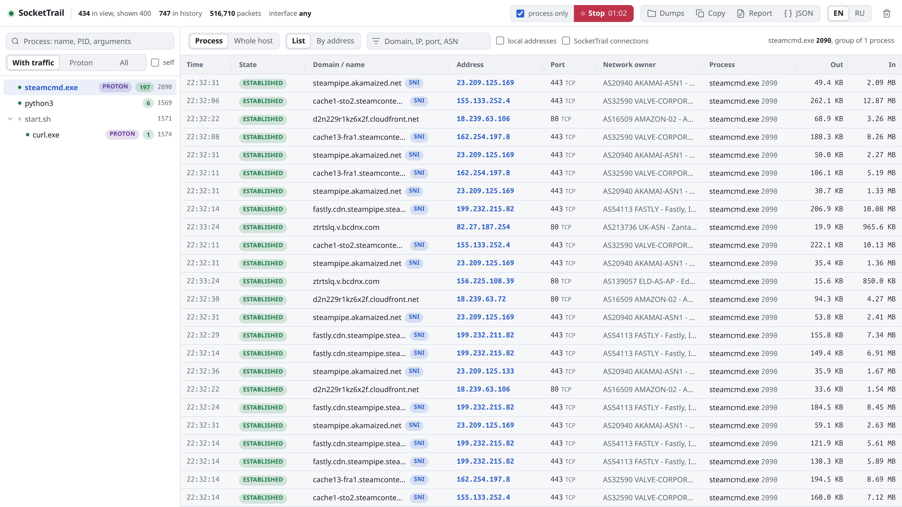
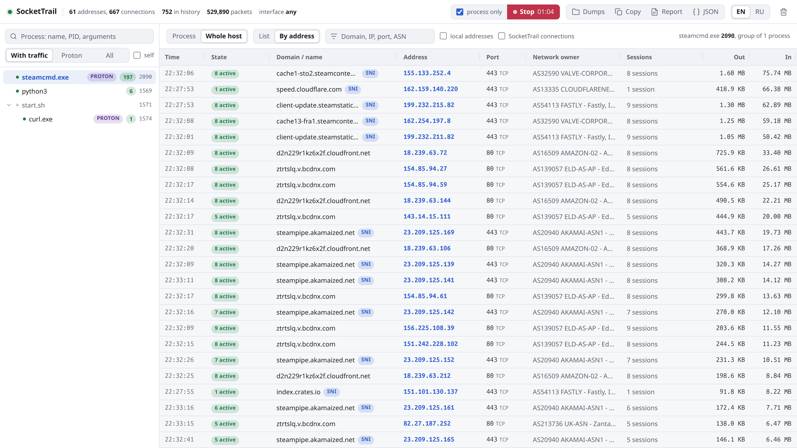
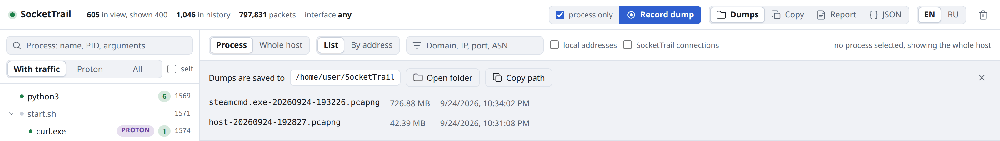

<div align="center">


# SocketTrail

**See which process talks to which domain.**<br>
A network monitor for Linux and Windows that ties every connection to its process,
including games under Proton and Wine.

<a href="https://github.com/mazixs/SocketTrail/actions/workflows/ci.yml"></a>
<a href="https://github.com/mazixs/SocketTrail/releases/latest"></a>
<a href="LICENSE"></a>


**English** | [Русский](README.ru.md)

</div>

<picture>
  <source media="(prefers-color-scheme: dark)" srcset="docs/images/main-en-dark.png">
  
</picture>

<p align="center"><sub>A real session: <code>steamcmd.exe</code> under Wine downloads a dedicated server from several CDNs at once.</sub></p>

Routing tools, split tunneling and proxy rules work with domains, while packet
sniffers and firewalls mostly show IP addresses. SocketTrail closes the gap: pick a
program and get the list of domains it really talks to, with ports, network owners
and traffic, ready to be turned into rules.

## Features

- **Domains, not only IPs.** Names come from TLS SNI and DNS responses seen on the
  wire, with PTR as a fallback, and are cached between runs.
- **Knows the process tree.** Selecting a process brings in all its descendants.
  Steam, pressure-vessel, wineserver and `game.exe` form one group, and sockets that
  Wine duplicates in wineserver are attributed to the `.exe`.
- **Catches short connections.** Sockets are polled every 250 ms, and packet parsing
  adds connections that lived shorter than that: crash reporters, telemetry, API
  calls at startup. Closed connections stay in the history.
- **Shows who owns the network.** ASN and owner for every address: Valve, Akamai,
  Fastly, Amazon and so on.
- **One-button dumps.** Record the traffic of one process into `.pcapng`. The
  recording stops by itself after the game exits, and every packet is labeled
  `game.exe [pid] -> domain` for Wireshark.
- **Export.** Self-contained HTML report, JSON, the table as TSV.
- **No root on Linux, no Wireshark on Windows.** Linux uses `dumpcap` with
  capabilities. Windows works without administrator rights and, with them, captures
  through the built-in PktMon driver.
- **English and Russian** interface.

## Quick start

### Linux

On Ubuntu 24.04+ or Debian 13+ take the `.deb` from
[Releases](https://github.com/mazixs/SocketTrail/releases/latest):

```sh
sudo apt install ./sockettrail_*_amd64.deb
```

On other distributions build from source. You need Rust and `dumpcap`
(`wireshark-cli` on Arch and Fedora):

```sh
git clone https://github.com/mazixs/SocketTrail && cd SocketTrail
./install.sh   # installs into ~/.local/bin and adds a menu shortcut, no root
```

Allow packet capture without root, once:

```sh
sudo dpkg-reconfigure wireshark-common   # Debian and Ubuntu, answer "Yes"
sudo usermod -aG wireshark "$USER"       # then log out and back in
```

Start **SocketTrail** from the application menu or run `sockettrail`.

### Windows 10 and 11

Download `SocketTrail-<version>-windows-x64.zip` from
[Releases](https://github.com/mazixs/SocketTrail/releases/latest), extract it and run
`sockettrail.exe`. Nothing to install. The exe is not signed yet, so SmartScreen may
ask: **More info** -> **Run anyway**.

The process and connection list works right away. The **Restart as administrator**
button in the window turns on packet capture: domains of browsers, traffic volume and
dumps. Details are in [docs/windows.md](docs/windows.md).

> [!NOTE]
> Domains fill in gradually. A name is learned when a program resolves it or opens
> a TLS connection, so a connection opened before SocketTrail started may show a
> bare IP for a while. Found names are saved and are there on the next run.

## Usage

1. **Pick a process** on the left. Its child processes come with it; the PROTON badge
   marks programs under Proton or Wine.
2. **Read the table.** Every connection has a domain, address, port, network owner
   and traffic. **By address** collapses the history into one row per target.
3. **Record a dump.** With **process only** checked, the file keeps the traffic of
   the selected process. Start it, play, and the recording stops 15 seconds after the
   game exits.
4. **Export** a report, JSON or the table, or open the dump in Wireshark and filter
   with `frame.comment contains "game.exe"`.

<details>
<summary>More screenshots</summary>
<br>

**By address**: one row per target with the session count and total traffic.

<picture>
  <source media="(prefers-color-scheme: dark)" srcset="docs/images/by-address-en-dark.png">
  
</picture>

**Dumps**: where files are saved and what has been recorded.

<picture>
  <source media="(prefers-color-scheme: dark)" srcset="docs/images/dumps-en-dark.png">
  
</picture>

</details>

## Documentation

- [Usage guide](docs/usage.md): the window, dumps and Wireshark, command line,
  background collection, where data is stored.
- [Windows](docs/windows.md): modes with and without administrator rights, PktMon,
  differences from Linux.
- [How it works](docs/how-it-works.md): data sources, process attribution, name
  resolution, code layout.
- [Development](docs/development.md): building, tests, cross-compiling for Windows,
  packages, releases.
- [Changelog](CHANGELOG.md): what changed between versions.

## Privacy

- The interface is served on `127.0.0.1` only. Requests with a foreign `Host` and
  POST requests from other sites are rejected.
- No telemetry, no accounts, no update checks.
- The only outgoing requests are DNS lookups for address names: PTR through the
  system resolver and ASN through
  [Team Cymru](https://www.team-cymru.com/ip-asn-mapping) (`origin.asn.cymru.com`).
- History, name cache and dumps stay on your disk.

## Contributing

Bug reports and pull requests are welcome. Building and testing are described in
[docs/development.md](docs/development.md).

## License

[MIT](LICENSE)
