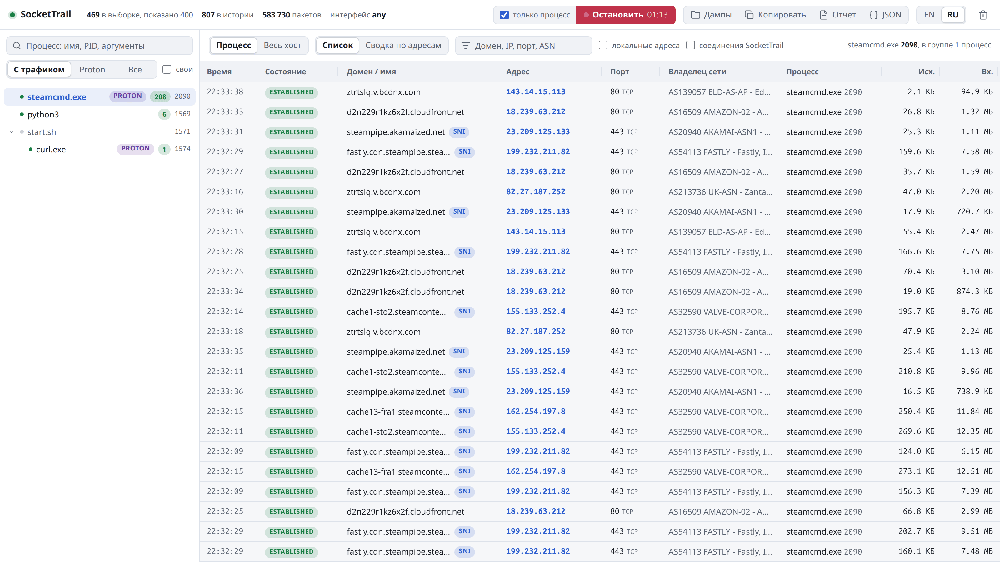

<div align="center">


# SocketTrail

**Видно, какой процесс с каким доменом говорит.**<br>
Сетевой монитор для Linux и Windows, который привязывает каждое соединение к процессу,
в том числе к играм под Proton и Wine.

<a href="https://github.com/mazixs/SocketTrail/actions/workflows/ci.yml"></a>
<a href="https://github.com/mazixs/SocketTrail/releases/latest"></a>
<a href="LICENSE"></a>


[English](README.md) | **Русский**

</div>

<picture>
  <source media="(prefers-color-scheme: dark)" srcset="docs/images/main-ru-dark.png">
  
</picture>

<p align="center"><sub>Настоящая сессия: <code>steamcmd.exe</code> под Wine качает выделенный сервер сразу с нескольких CDN.</sub></p>

Маршрутизация, split tunneling и правила прокси работают с доменами, а снифферы и
фаерволы в основном показывают IP-адреса. SocketTrail закрывает этот разрыв: выберите
программу и получите список доменов, с которыми она на самом деле общается, с портами,
владельцами сетей и трафиком. Из него сразу пишутся правила.

## Возможности

- **Домены, а не только IP.** Имена берутся из TLS SNI и DNS-ответов в трафике, PTR
  идет запасным вариантом. Найденные имена сохраняются между запусками.
- **Понимает дерево процессов.** Вместе с процессом выбираются все его потомки. Steam,
  pressure-vessel, wineserver и `game.exe` - одна группа, а сокеты, которые Wine
  дублирует в wineserver, приписываются самому `.exe`.
- **Ловит короткие соединения.** Сокеты опрашиваются каждые 250 мс, а разбор пакетов
  добавляет соединения, которые прожили меньше: отправку отчетов о падении, телеметрию,
  API-запросы при старте. Закрытые соединения остаются в истории.
- **Показывает владельца сети.** ASN и организация для каждого адреса: Valve, Akamai,
  Fastly, Amazon и так далее.
- **Дамп одной кнопкой.** Трафик одного процесса пишется в `.pcapng`. Запись
  останавливается сама после выхода из игры, а каждый пакет подписан для Wireshark:
  `game.exe [pid] -> домен`.
- **Экспорт.** Автономный HTML-отчет, JSON, таблица в TSV.
- **Без root на Linux, без Wireshark на Windows.** На Linux используется `dumpcap` с
  capabilities. На Windows все работает без прав администратора, а с ними включается
  захват через встроенный драйвер PktMon.
- Интерфейс на **английском и русском**.

## Быстрый старт

### Linux

Для Ubuntu 24.04+ и Debian 13+ возьмите `.deb` на странице
[Releases](https://github.com/mazixs/SocketTrail/releases/latest):

```sh
sudo apt install ./sockettrail_*_amd64.deb
```

На других дистрибутивах соберите из исходников. Нужны Rust и `dumpcap`
(`wireshark-cli` в Arch и Fedora):

```sh
git clone https://github.com/mazixs/SocketTrail && cd SocketTrail
./install.sh   # ставит в ~/.local/bin и добавляет ярлык в меню, без root
```

Один раз разрешите захват пакетов без root:

```sh
sudo dpkg-reconfigure wireshark-common   # Debian и Ubuntu, ответ "Да"
sudo usermod -aG wireshark "$USER"       # затем перезайдите в сеанс
```

Запустите **SocketTrail** из меню приложений или командой `sockettrail`.

### Windows 10 и 11

Скачайте `SocketTrail-<версия>-windows-x64.zip` со страницы
[Releases](https://github.com/mazixs/SocketTrail/releases/latest), распакуйте и
запустите `sockettrail.exe`. Устанавливать ничего не нужно. Exe пока не подписан,
поэтому SmartScreen может спросить: **Подробнее** -> **Выполнить в любом случае**.

Список процессов и соединений работает сразу. Кнопка **Перезапустить от
администратора** в окне включает захват пакетов: домены браузеров, объем трафика и
дампы. Подробности в [docs/ru/windows.md](docs/ru/windows.md).

> [!NOTE]
> Домены появляются постепенно. Имя становится известно, когда программа его
> разрешает или открывает TLS-соединение, поэтому у соединения, открытого до запуска
> SocketTrail, какое-то время может быть виден только IP. Найденные имена сохраняются
> и есть уже при следующем запуске.

## Как пользоваться

1. **Выберите процесс** слева. Дочерние процессы идут вместе с ним, плашка PROTON
   отмечает программы под Proton или Wine.
2. **Смотрите таблицу.** У каждого соединения есть домен, адрес, порт, владелец сети и
   трафик. **Сводка по адресам** сворачивает историю в одну строку на адрес.
3. **Соберите дамп.** С галочкой **только процесс** в файле остается трафик выбранного
   процесса. Запустите запись и играйте: она остановится через 15 секунд после выхода
   из игры.
4. **Выгрузите** отчет, JSON или таблицу, либо откройте дамп в Wireshark с фильтром
   `frame.comment contains "game.exe"`.

<details>
<summary>Еще скриншоты</summary>
<br>

**Сводка по адресам**: одна строка на адрес с числом сессий и общим трафиком.

<picture>
  <source media="(prefers-color-scheme: dark)" srcset="docs/images/by-address-ru-dark.png">
  
</picture>

**Дампы**: куда сохраняются файлы и что уже записано.

<picture>
  <source media="(prefers-color-scheme: dark)" srcset="docs/images/dumps-ru-dark.png">
  
</picture>

</details>

## Документация

- [Руководство](docs/ru/usage.md): окно, дампы и Wireshark, командная строка, фоновый
  сбор, где лежат данные.
- [Windows](docs/ru/windows.md): режимы с правами администратора и без, PktMon,
  отличия от Linux.
- [Как это работает](docs/ru/how-it-works.md): источники данных, привязка к процессам,
  имена, устройство кода.
- [Разработка](docs/ru/development.md): сборка, тесты, кросс-сборка под Windows,
  пакеты, релизы.
- [Changelog](CHANGELOG.md): изменения между версиями, на английском.

## Приватность

- Интерфейс доступен только на `127.0.0.1`. Запросы с чужим `Host` и POST-запросы с
  других сайтов отклоняются.
- Нет телеметрии, учетных записей и проверки обновлений.
- Наружу уходят только DNS-запросы для имен адресов: PTR через системный резолвер и
  ASN через [Team Cymru](https://www.team-cymru.com/ip-asn-mapping)
  (`origin.asn.cymru.com`).
- История, кеш имен и дампы остаются на вашем диске.

## Участие

Сообщения об ошибках и pull request приветствуются. Сборка и тесты описаны в
[docs/ru/development.md](docs/ru/development.md).

## Лицензия

[MIT](LICENSE)
