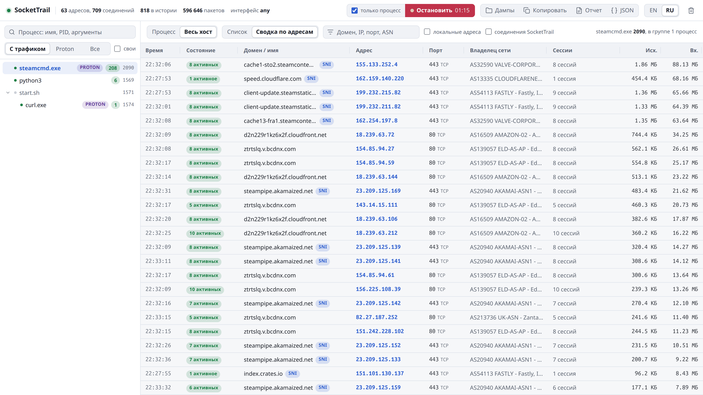
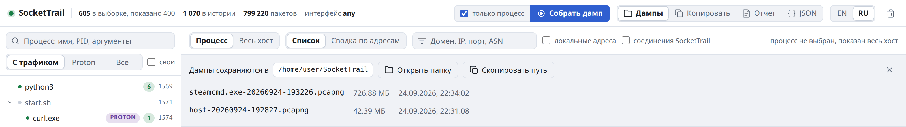

# Руководство

[English](../usage.md) | **Русский** · [К README](../../README.ru.md)

- [Окно](#окно)
- [Выбор процесса](#выбор-процесса)
- [Таблица соединений](#таблица-соединений)
- [Сводка по адресам](#сводка-по-адресам)
- [Дампы](#дампы)
- [Отчеты и экспорт](#отчеты-и-экспорт)
- [Откуда берутся имена и порты](#откуда-берутся-имена-и-порты)
- [Командная строка](#командная-строка)
- [Фоновый сбор](#фоновый-сбор)
- [Язык](#язык)
- [Где лежат данные](#где-лежат-данные)

## Окно

SocketTrail открывает собственное окно: Chrome, Chromium, Edge, Brave или Vivaldi в
режиме приложения с отдельным профилем. Оно не смешивается с обычным браузером и
имеет свою иконку на панели задач. Если браузера на Chromium нет, откроется обычная
вкладка.

**Закрытие окна завершает программу**: незаконченный дамп дописывается, кеш имен
сохраняется, `dumpcap` останавливается. Ctrl+C и SIGTERM делают то же самое.
Повторный запуск не создает вторую копию, а открывает окно уже работающей.

В шапке: счетчики (соединений в выборке, в истории, разобранных пакетов), интерфейс
захвата, управление дампом, кнопки **Дампы**, **Копировать**, **Отчет**, **JSON**,
переключатель EN | RU и кнопка очистки истории.

## Выбор процесса

Слева дерево процессов, оно обновляется само.

- **С трафиком**, **Proton** и **Все** фильтруют дерево, **свои** показывает еще и сам
  SocketTrail с его `dumpcap`. Поиск идет по имени, PID и аргументам.
- Зеленая точка - есть активные соединения, число - сколько соединений, плашка
  PROTON - программа под Proton или Wine.
- Вместе с процессом выбираются все его потомки, поэтому игра под Proton видна вместе
  с цепочкой запуска. Десяток одноименных листьев, например вкладки браузера,
  сворачивается в одну строку вида `chrome x12`.

## Таблица соединений

**Процесс** показывает выбранную группу, **Весь хост** - все соединения компьютера.
**Список** - история построчно, **Сводка по адресам** описана ниже.

- Закрытые соединения остаются в списке. Строки с пометкой **только пакеты** пойманы
  разбором пакетов и ни разу не попали в таблицу сокетов: они прожили меньше
  интервала опроса в 250 мс.
- Плашка **SNI** значит, что имя взято из TLS-рукопожатия этого самого соединения. Это
  самый надежный источник.
- Поле фильтра ищет по домену, IP, порту и ASN.
- **локальные адреса** показывает трафик к 127.0.0.53, mDNS, SSDP и другим локальным
  адресам, **соединения SocketTrail** - служебный трафик самой программы. По умолчанию
  и то и другое скрыто.
- Границы колонок можно тянуть. Двойной клик по границе подгоняет ширину под самое
  длинное значение. Ширины запоминаются, как и ширина левой панели.
- Значок копирования в строке кладет домен или адрес в буфер обмена.

Домены появляются постепенно. DNS-ответ виден один раз, когда программа разрешает
имя, поэтому соединение, открытое до запуска SocketTrail, получает имя из кеша, из
следующего TLS-рукопожатия или из PTR. На Windows без прав администратора DNS-кеш
системы опрашивается каждые 3 секунды.

## Сводка по адресам

<picture>
  <source media="(prefers-color-scheme: dark)" srcset="../images/by-address-ru-dark.png">
  
</picture>

История сворачивается по адресу и порту: вместо трехсот строк TIME_WAIT к одному узлу
CDN видна одна строка с числом сессий, сколько из них активно сейчас, и общим трафиком.
Отсюда удобнее всего копировать домены для правил маршрутизации.

## Дампы

<picture>
  <source media="(prefers-color-scheme: dark)" srcset="../images/dumps-ru-dark.png">
  
</picture>

**Собрать дамп** пишет `~/SocketTrail/<процесс>-<дата>.pcapng` (на Windows
`%USERPROFILE%\SocketTrail`). Кнопка **Дампы** в шапке показывает папку, записанные
файлы и кнопки, чтобы открыть папку или скопировать путь.

- С галочкой **только процесс** в файле остается трафик выбранного процесса и его
  потомков, включая соединения, открытые уже после начала записи. Отбор идет по
  владельцу соединения в момент остановки, поэтому серверы, к которым игра подключится
  позже, не теряются. Пакеты, которые не удалось сопоставить с соединением, но которые
  идут к адресу, с которым говорил процесс, остаются без подписи.
- Такая запись останавливается сама через 15 секунд после выхода процесса: запустите
  ее, играйте и не следите.
- Без галочки пишется весь трафик компьютера.
- Пакеты пишутся целиком. Дамп, снятый во время скачивания обновления игры, весит
  столько же, сколько обновление.

При остановке каждый пакет подписывается процессом и доменом. В Wireshark подпись
лежит в поле `frame.comment`: щелкните по нему правой кнопкой в деталях пакета и
выберите **Apply as Column**, либо отфильтруйте `frame.comment contains "game.exe"`.
В `tshark` работает то же самое. Вот дамп `steamcmd.exe` под Wine:

```console
$ tshark -r steamcmd.exe-20260924-193226.pcapng -T fields -e frame.comment | sort | uniq -c | sort -rn | head -6
 139498 steamcmd.exe [2090] -> fastly.cdn.steampipe.steamcontent.com
 126884 steamcmd.exe [2090] -> steampipe.akamaized.net
 100588 steamcmd.exe [2090] -> ztrtslq.v.bcdnx.com
  87159 steamcmd.exe [2090] -> cache1-sto2.steamcontent.com
  83006 steamcmd.exe [2090] -> d2n229r1kz6x2f.cloudfront.net
  50885 steamcmd.exe [2090] -> cache13-fra1.steamcontent.com
```

Рядом с дампом сохраняется `.json`: период записи, процесс и PID его группы, все
соединения с доменом, PTR, ASN, владельцем сети и трафиком. Через неделю по нему все
еще понятно, что записано, даже если процесс завершился задолго до остановки записи.

## Отчеты и экспорт

- **Отчет** сохраняет автономный HTML-файл, который открывается без интернета.
- **JSON** сохраняет те же данные в машиночитаемом виде.
- Оба берут текущую выборку: выбранный процесс или весь хост.
- **Копировать** кладет всю видимую таблицу в буфер обмена в формате TSV, ее можно
  сразу вставить в таблицу.

## Откуда берутся имена и порты

Порт всегда настоящий. У живых соединений он читается из таблицы сокетов, у пойманных
разбором пакетов - из заголовка TCP или UDP. Никаких значений по умолчанию и догадок
по типу сервиса: если порт неизвестен, строки нет совсем.

Имя адреса берется из четырех источников по убыванию надежности:

1. SNI из TLS ClientHello этого соединения.
2. DNS-ответы, увиденные в трафике, включая цепочки CNAME.
3. PTR-запись.
4. Подпись для особых адресов: `127.0.0.53` - это сам системный резолвер, домена у
   него не бывает.

Имя из DNS заменяет PTR-имя, если пришло позже. Имена хранятся в кеше и переживают
перезапуск.

Владелец сети - это ASN и название организации, которая анонсирует адрес. Он часто
расходится с PTR: у адреса может быть PTR одной компании, а обслуживать его будет сеть
другой, поэтому показывается и то и другое.

## Командная строка

| Ключ | Значение |
|---|---|
| `-i`, `--iface <имя>` | интерфейс захвата, несколько через запятую. По умолчанию `any` на Linux и все адаптеры Npcap, кроме loopback, на Windows. Захват через PktMon на Windows всегда идет со всех адаптеров |
| `--port <порт>` | порт локального интерфейса, по умолчанию 8787. Если он занят другой программой, берется следующий свободный |
| `--no-open` | запустить только сервер, без окна |
| `--lang <en\|ru>` | язык на этот запуск |
| `-h`, `--help` | справка |

## Фоновый сбор

Чтобы история копилась еще до открытия окна, например с входа в систему до запуска
игры, запустите SocketTrail как пользовательский сервис systemd:

```sh
mkdir -p ~/.config/systemd/user
cp assets/sockettrail.service ~/.config/systemd/user/
systemctl --user enable --now sockettrail
```

Пакет `.deb` уже ставит этот unit в выключенном виде, нужна только последняя команда.
В этом режиме `dumpcap` работает постоянно и разбирает весь трафик компьютера. Окно
открывается как обычно, командой `sockettrail` или ярлыком: оно подключается к
работающему сервису, и его закрытие не останавливает сбор.

## Язык

Интерфейс есть на английском и русском, по умолчанию английский. Переключатель
EN | RU в шапке меняет язык окна, HTML-отчета и сообщений в консоли, выбор
сохраняется. `--lang en|ru` задает язык при запуске.

## Где лежат данные

| | Linux | Windows |
|---|---|---|
| Дампы | `~/SocketTrail` | `%USERPROFILE%\SocketTrail` |
| Кеш имен, язык, профиль окна | `~/.cache/sockettrail` | `%LOCALAPPDATA%\SocketTrail` |

Папка дампов в домашнем каталоге - это не папка репозитория с тем же именем.
