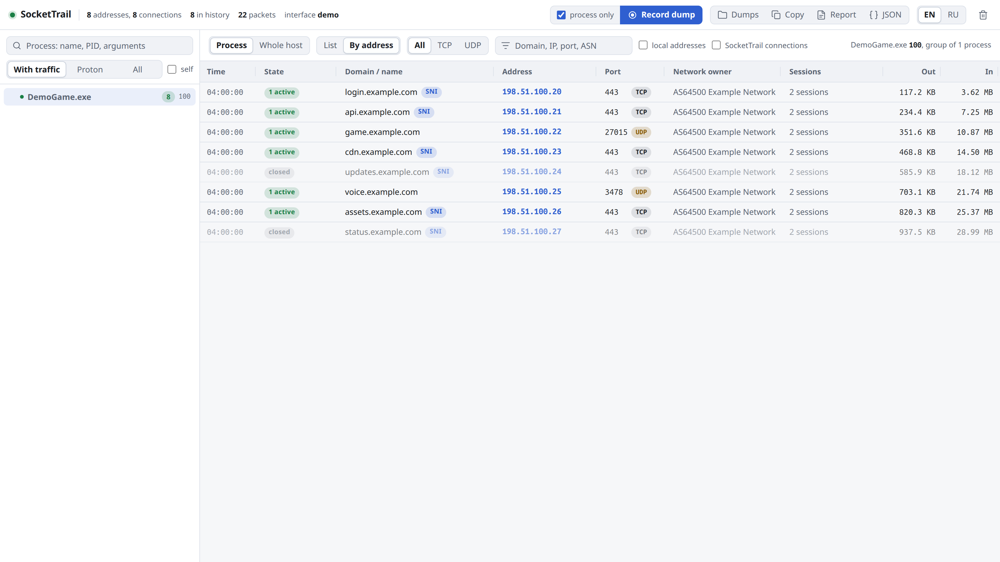
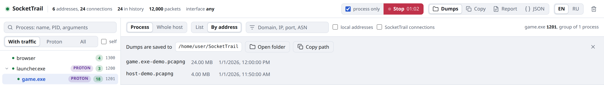

# Usage guide

**English** | [Русский](ru/usage.md) · [Back to README](../README.md)

- [The window](#the-window)
- [Picking a process](#picking-a-process)
- [The connection table](#the-connection-table)
- [By address](#by-address)
- [Dumps](#dumps)
- [Reports and export](#reports-and-export)
- [Where names and ports come from](#where-names-and-ports-come-from)
- [Command line](#command-line)
- [Background collection](#background-collection)
- [Language](#language)
- [Where data is stored](#where-data-is-stored)

## The window

SocketTrail opens its own window: Chrome, Chromium, Edge, Brave or Vivaldi in app
mode with a separate profile. It does not mix with your regular browser and has its
own taskbar icon. Without a Chromium-based browser a regular tab opens.

**Closing the window exits the program**: an unfinished dump is finalized, the name
cache is saved, capture is stopped. Ctrl+C and SIGTERM do the same. Running
SocketTrail again does not start a second copy: the window of the running one opens.

The header holds the counters (connections in view, in history, packets parsed), the
capture interface, the dump controls, **Dumps**, **Copy**, **Report**, **JSON**, the
EN | RU switch and the button that clears the history.

## Picking a process

The left panel is a process tree that refreshes by itself.

- **With traffic**, **Proton** and **All** filter the tree; **self** also shows
  SocketTrail and its `dumpcap`. The search box matches the name, PID and arguments.
- A green dot means active connections, the number is the connection count, the
  PROTON badge marks programs under Proton or Wine.
- Selecting a process brings in all its descendants, so a game under Proton is seen
  together with its launcher chain. A dozen leaves with the same name, like browser
  tabs, collapse into one row such as `chrome x12`.
- The tree works from the keyboard: the arrows move between rows, Right and Left
  expand and collapse a branch, Enter or Space selects a process.

## The connection table

**Process** shows the selected group, **Whole host** shows every connection of the
computer. **List** is the history row by row, **By address** is the summary below.

- Closed connections stay in the list. Rows marked **packets only** were caught by
  packet parsing and never showed up in the socket table: they lived shorter than the
  250 ms polling interval.
- The **SNI** badge means the name came from the TLS or QUIC handshake of this very
  connection, which is the most reliable source.
- The port cell carries a **TCP** or **UDP** badge. The **All / TCP / UDP** switch
  limits the table to one protocol.
- The filter box matches domain, IP, port, ASN and protocol: `udp` keeps UDP only.
- **local addresses** shows traffic to 127.0.0.53, mDNS, SSDP and other local
  targets; **SocketTrail connections** shows the program's own service traffic.
  Both are hidden by default.
- Column borders can be dragged. A double click on a border fits the column to the
  longest value. Widths are remembered, as is the width of the left panel.
- The copy icon in a row puts the domain or address into the clipboard.

Domains fill in gradually. A DNS response is seen once, when the program resolves the
name, so a connection opened before SocketTrail started gets its name from the cache,
from the next TLS handshake or from PTR. On Windows without administrator rights the
system DNS cache is polled every 3 seconds.

## By address

<picture>
  <source media="(prefers-color-scheme: dark)" srcset="images/by-address-en-dark.png">
  
</picture>

The history collapses by address and port: instead of three hundred TIME_WAIT rows to
one CDN node there is one row with the number of sessions, how many are active now and
the total traffic. This is the view to copy domains from when writing routing rules.

## Dumps

<picture>
  <source media="(prefers-color-scheme: dark)" srcset="images/dumps-en-dark.png">
  
</picture>

**Record dump** writes `~/SocketTrail/<process>-<date>.pcapng` (on Windows
`%USERPROFILE%\SocketTrail`). **Dumps** in the header shows the folder, the recorded
files and buttons to open the folder or copy its path.

- With **process only** checked, the file keeps the traffic of the selected process
  and its children, including connections opened after the recording started. The
  selection uses confirmed connection ownership retained throughout recording, so
  servers the game connects to later and older connections evicted from the live
  history are not lost. Packets with unknown or disputed ownership are excluded,
  even when their IP or domain matches a known connection. To inspect those packets,
  record the whole computer and use the unfiltered connection list.
- Such a recording stops by itself 15 seconds after the process exits: start it, play
  and do not watch it.
- Without the checkbox all traffic of the computer is recorded.
- Packets are recorded in full. A dump taken while a game downloads an update is as
  large as the update.

On stop every packet is labeled with its process and domain. In Wireshark the label is
the `frame.comment` field: right-click it in the packet details and choose
**Apply as Column**, or filter with `frame.comment contains "game.exe"`. The same
works in `tshark`. The following is a synthetic example, not a real session:

```console
$ tshark -r game.exe-demo.pcapng -T fields -e frame.comment | sort | uniq -c | sort -rn | head -3
 120 game.exe [1201] -> cdn.example.com
  80 game.exe [1201] -> api.example.com
  40 game.exe [1201] -> updates.example.com
```

A `.json` file is saved next to the dump: the recording period, the process and the
PIDs of its group, and every connection with its domain, PTR, ASN, owner and traffic.
A week later it is still clear what was recorded, even if the process exited long
before the recording was stopped.

The recording button is disabled while a request or finalization is in progress.
Capture or processing failures show an error instead of a successful save message.
If process filtering fails, the original file remains unfiltered; the UI reports
its path and the JSON map records `only_process: false`. Such a file may contain
traffic from the whole host.

## Reports and export

- **Report** saves a self-contained HTML file that opens without internet access.
- **JSON** saves the same data in a machine-readable form.
- Both take the current scope (the selected process or the whole host), the filter
  box and the protocol switch. Local addresses are always included, SocketTrail's own
  connections never are.
- **Copy** puts the whole visible table into the clipboard as TSV, ready for a
  spreadsheet.

## Where names and ports come from

The port is always real. For live connections it is read from the socket table, for
connections caught by packet parsing from the TCP or UDP header. There are no
defaults and no guesses by service type: if the port is unknown, there is no row.

The name of an address comes from four sources, in order of reliability:

1. SNI from the ClientHello of the connection: TLS over TCP or QUIC.
2. DNS responses seen in the traffic, including CNAME chains.
3. The PTR record.
4. A label for special addresses: `127.0.0.53` is the system resolver itself and
   never has a domain.

A name from DNS replaces a PTR name if it arrives later. An existing connection
keeps its first DNS name until SNI replaces it. DNS cache entries survive a restart
until their TTL expires; simultaneous names for one IP remain ambiguous.

The network owner is the ASN and the name of the organization that announces the
address. It often differs from the PTR name: an address can have a PTR of one company
and be served by the network of another, so both are shown.

## Command line

| Option | Meaning |
|---|---|
| `-i`, `--iface <name>` | capture interface, several separated by commas. Linux only, default `any`. The own PktMon/ETW engine on Windows always uses all adapters |
| `--port <port>` | port of the local interface, default 8787. If another program holds it, the next free one is used |
| `--no-open` | start the server only, without a window |
| `--lang <en\|ru>` | language for this run |
| `-h`, `--help` | help |

## Background collection

To have the history build up before the window is opened, for example from login until
the game starts, run SocketTrail as a systemd user service:

```sh
systemctl --user enable --now sockettrail
```

`install.sh` and the `.deb` package install this unit disabled, with the path to
the installed binary, and `uninstall.sh` removes it. In this mode `dumpcap` runs all
the time and parses all traffic of the computer. Open the window with `sockettrail`
or the menu shortcut as usual: it connects to the running service, and closing it
does not stop the collection.

## Language

The interface is available in English and Russian, English by default. The EN | RU
switch in the header changes the window, the HTML report and log messages, and the
choice is saved. `--lang en|ru` sets the language at startup.

## Where data is stored

| | Linux | Windows |
|---|---|---|
| Dumps | `~/SocketTrail` | `%USERPROFILE%\SocketTrail` |
| Name cache, language, window profile | `~/.cache/sockettrail` | `%LOCALAPPDATA%\SocketTrail` |

The dump folder in the home directory is not the repository folder of the same name.
